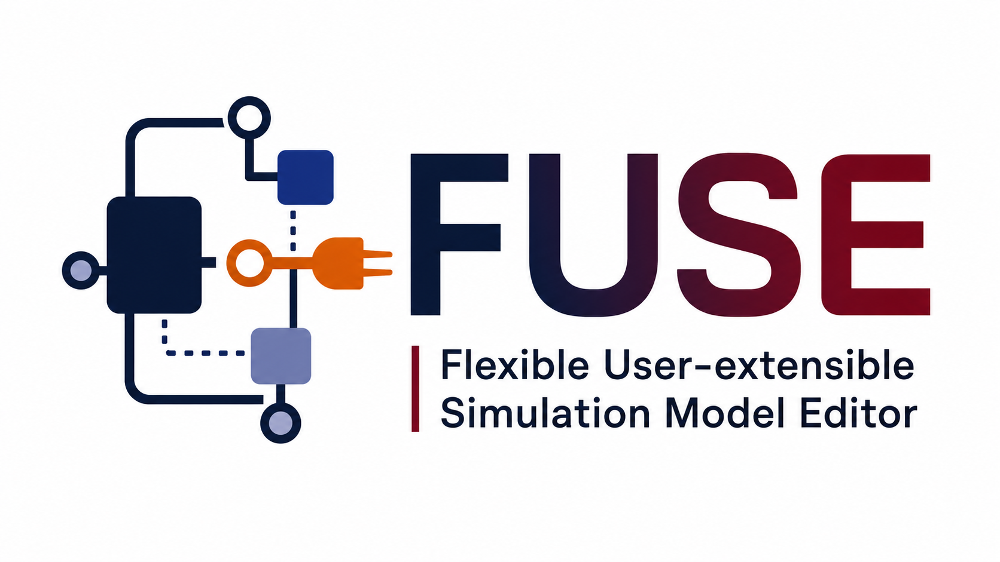

<p align="center">
  
</p>

# FUSE Community Edition

**FUSE** — the **Flexible User-extensible Simulation Editor** — is a graphical model-building environment for composing, configuring, visualizing, and eventually exporting simulation models for computer architecture and systems research workflows.

FUSE is being developed by **PKB Research Labs, LLC**.

The goal of FUSE is to provide an extensible editor where users can drag architecture components into a model canvas, connect them using typed links, inspect and edit component parameters, validate model configuration, and support multiple simulation/modeling backends through a plugin system.

## Testing status

[](https://github.com/PKBLabs/fuse/actions/workflows/core-tests.yml)
[](https://github.com/PKBLabs/fuse/actions/workflows/sst-integration.yml)
[](https://github.com/PKBLabs/fuse/actions/workflows/gem5-integration.yml)

Core tests run on every push and pull request. SST and gem5 integration tests require prebuilt simulator CI images and are run manually, weekly, or when relevant plugin code changes.

## Current development status

FUSE is currently in early active development.

The current community version includes:

- A Qt/PySide6-based graphical application.
- A drag-and-drop model canvas.
- Component icons for architecture-style units.
- Link creation between component ports.
- A dockable properties/parameter panel.
- Basic required-parameter validation.
- Basic project save/load support.
- A plugin-oriented architecture.
- Community plugin directories for:
  - SST
  - gem5

The SST plugin currently provides support for importing SST component metadata using `sst-info` and storing SST-specific metadata in plugin-specific database tables.

The gem5 plugin is currently included as part of the community plugin structure, but its functionality may be incomplete or placeholder-level depending on the current development branch.

This project is not yet a stable production release. File formats, plugin APIs, database schemas, UI behavior, and project structure may change as development continues.

## Community Edition

This repository contains the **FUSE Community Edition**.

The Community Edition ships with community plugin support and includes the SST and gem5 plugin directories as part of the community distribution.

## Licensing model

FUSE uses an open-core licensing model.

The FUSE Community Edition is free software licensed under the GNU General Public License, version 3 or later.

PKB Research Labs, LLC may also offer commercial licenses, paid plugins, commercial model libraries, enterprise integrations, support, training, and custom development services.

Community contributions are welcome, but accepted contributions require a FUSE Contributor License Agreement so that PKB Research Labs, LLC can maintain both the open-source community edition and commercial offerings.

## Plugins

FUSE supports a public, versioned plugin API.

Community plugins are welcome. Plugins submitted to official FUSE repositories must follow the project contribution policy and may require a signed Contributor License Agreement.

PKB Research Labs, LLC may release both free community plugins and paid commercial plugins. Commercial plugins are licensed separately and are not automatically covered by the GPL license that applies to the FUSE Community Edition.

See `PLUGIN-POLICY.md` and `PLUGIN-API-STABILITY.md`.

## Requirements

FUSE currently requires Python 3.12 or newer.

The Python dependencies are listed in `requirements.txt`.

The current development dependencies include:

- PySide6
- pandas
- numpy
- python-dateutil

For SST metadata import, the SST plugin expects `sst-info` to be available on your `PATH`. If `sst-info` is not installed, the SST plugin can still be discovered and initialized, but SST component import will be skipped.

## Setup / development install

From the FUSE package root — the directory containing `requirements.txt` and `scripts/setup_dev.sh` — run:

```bash
chmod +x scripts/setup_dev.sh
./scripts/setup_dev.sh
```

The setup script will:

1. Create a local Python virtual environment at `.venv/`.
2. Install Python dependencies from `requirements.txt`.
3. Initialize the FUSE database.
4. Discover enabled plugins.
5. Let enabled plugins create plugin-specific database tables.
6. Optionally let plugins run bootstrap/import logic.
7. Install a `fuse-mod` launcher into `~/.local/bin`.

If `~/.local/bin` is not already on your shell path, add it:

```bash
echo 'export PATH="$HOME/.local/bin:$PATH"' >> ~/.bashrc
source ~/.bashrc
```

## Running FUSE

After setup, run:

```bash
fuse-mod
```

If you prefer to run directly during development, use the project launcher script or run the module from the parent directory of the `fuse` package:

```bash
cd ..
fuse/.venv/bin/python -m fuse.app.main
```

If you are running from the FUSE package root, you can also use:

```bash
PYTHONPATH="$(pwd)/.." .venv/bin/python -m fuse.app.main
```

## Resetting the development database

To reset the local development database:

```bash
rm -f app_data/app.db
./scripts/setup_dev.sh
```

To force the SST plugin to refresh `sst-info` metadata, run:

```bash
FUSE_REFRESH_SSTINFO=1 ./scripts/setup_dev.sh
```

## SST plugin

The SST community plugin is intended to support workflows around SST model construction.

Current SST plugin responsibilities include:

- Running or reading `sst-info` output.
- Parsing SST element, component, subcomponent, parameter, port, statistic, and subcomponent slot metadata.
- Populating SST-specific database tables.
- Mapping SST components to generic architecture icons where possible.
- Providing FUSE palette items and component details through the plugin API.

If `sst-info` is not installed, the SST plugin will skip SST metadata import.

## gem5 plugin

The gem5 community plugin is included as part of the FUSE Community Edition plugin structure.

Current gem5 support may be incomplete or placeholder-level depending on the branch. The intended direction is for the gem5 plugin to provide gem5-specific component discovery, metadata import, project integration, and eventual export/generation support through the same public plugin API used by other FUSE plugins.

## Contributing

Community contributions are welcome.

Accepted contributions require a FUSE Contributor License Agreement so that PKB Research Labs, LLC can maintain both the open-source FUSE Community Edition and commercial FUSE offerings.

Before contributing plugins, integrations, or major architectural changes, please review:

- `PLUGIN-POLICY.md`
- `PLUGIN-API-STABILITY.md`

## License

FUSE Community Edition is licensed under the GNU General Public License, version 3 or later.

See the project license files for full terms.
