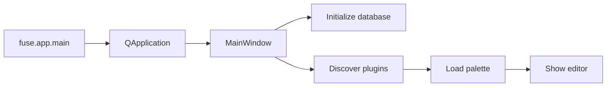
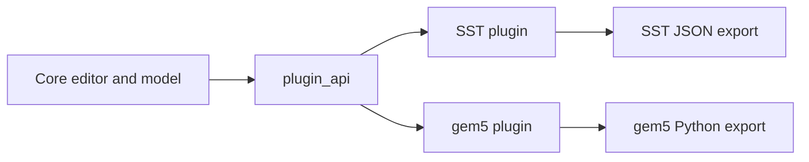
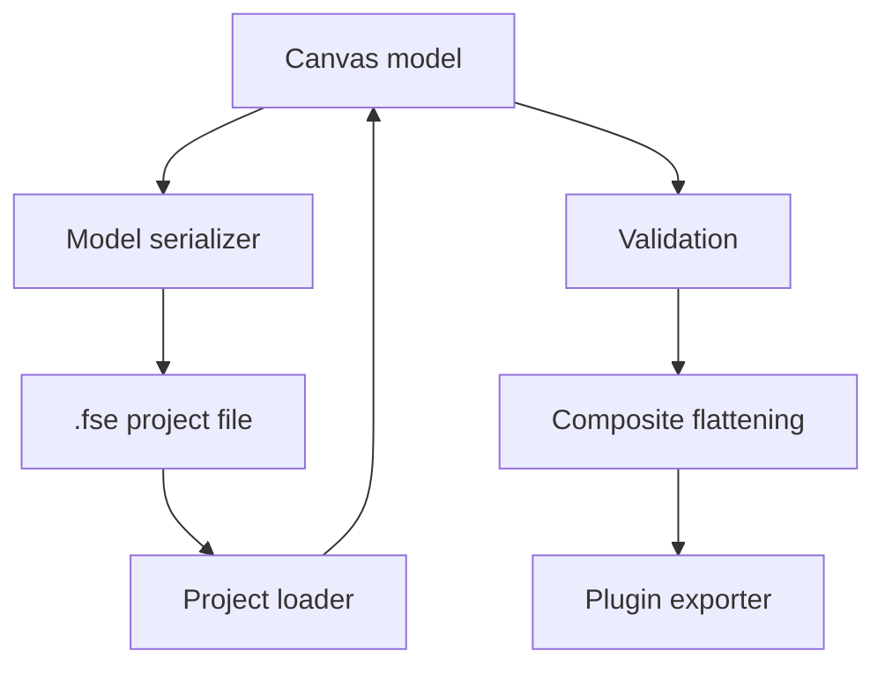
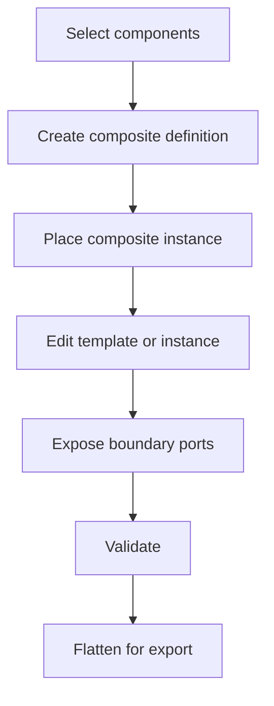

# Architecture diagrams

This page records the diagrams needed for the v1.0 documentation set. Source diagrams should be kept reviewable in Markdown/Mermaid where possible.

## Application startup

## Core and plugin boundary

## Persistence and export

## Composite lifecycle

